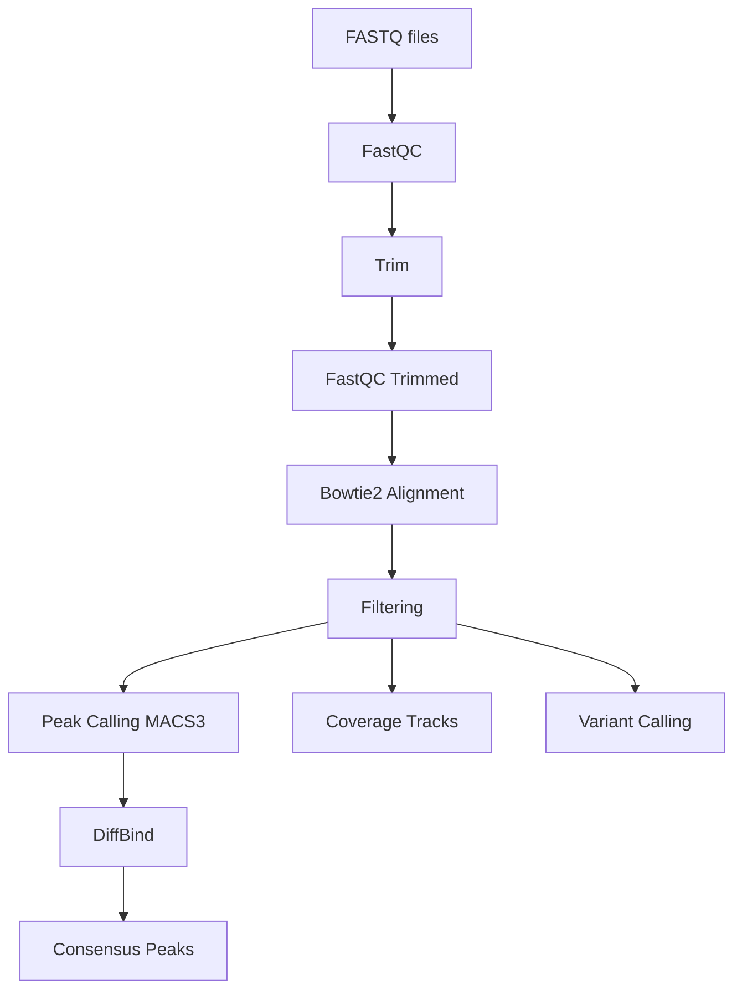

# CutTagFlow
[](https://www.nextflow.io/)
[
[
[](https://orcid.org/0000-0001-7697-1696)


## Introduction
CutTagFlow is a reproducible and scalable Nextflow pipeline designed for the processing and analysis of CUT&Tag sequencing data, from raw reads to high-quality peak calling and downstream quality control.

This pipeline is optimized for histone modification profiling, supporting both:

- **Narrow peaks**: H3K4me3, H3K27Ac  
- **Broad domains**: H3K27me3, H3K9me3, H3K36me3, H3K4me1, H3K4me2  

CutTagFlow is designed to work **without spike-in controls or IgG samples**, simplifying experimental design while maintaining robust analytical performance. To ensure optimal data interpretation, the pipeline performs analyses **both with duplicate reads retained and with duplicates removed**, allowing users to choose the most appropriate result depending on signal characteristics.



### Execution environment

Currently, CutTagFlow is supported **only in HPC environments** with:

- A **job scheduler / queue manager** (e.g. SLURM, PBS, SGE)
- Containerized execution via **Singularity or Apptainer** (Docker images can be used through these)

**Local execution is not yet supported**, including:
- Interactive local servers
- Personal workstations or laptops  

Support for local environments may be added in future versions.

### Installation

CutTagFlow does not require a traditional installation. You can simply clone the repository:

```bash
git clone https://github.com/CarlosRangel23/CutTagFlow.git
cd CutTagFlow
```

#### Requirements

* Nextflow (DSL2 compatible versions)
* Singularity or Apptainer (recommended for HPC environments)

## Usage
### Input data format

Input samples must be specified in a samplesheet following the format defined in [data/example_samplesheet.csv](https://github.com/CarlosRangel23/CutTagFlow/blob/main/data/example_samplesheet.csv)

#### Required columns
The samplesheet must contain the following columns:

```
sample,fastq1,fastq2,histone_mark
```


* The **`sample` column must follow the format**:
  ```
  sampleName_histoneMark
  ```

* The `fastq1` column must contain path to r1 file.
* The `fastq2` column must contain path to r2 file.
* The `histone_mark` column must match the corresponding modification.


#### Example

```csv
sample,fastq1,fastq2,histone_mark
BPES2_H3K27Ac,/path/to/file_r1.fastq.gz,/path/to/file_r2.fastq.gz,H3K27Ac
BPES2_H3K4me3,/path/to/file_r1.fastq.gz,/path/to/file_r2.fastq.gz,H3K4me3
BPES4_H3K27Ac,/path/to/file_r1.fastq.gz,/path/to/file_r2.fastq.gz,H3K27Ac
BPES4_H3K4me3,/path/to/file_r1.fastq.gz,/path/to/file_r2.fastq.gz,H3K4me3
```

### Running the pipeline
Before running, load Nextflow in your HPC cluster. Be aware that your cluster may have some guidance or specific rules for using Nextflow.

```bash
module load apps/binapps/nextflow/25.10.4
```

```bash
nextflow run main.nf --samplesheet data/example_samplesheet.csv [options]
```

### Available parameters

- You can execute the entire pipeline with `--all true`

#### First steps (preprocessing and alignment)

- **first_steps** → perform all preprocessing and alignment    

- **fastqc**  
  Runs quality control on raw FASTQ files using FastQC. Runs also MultiQC.

- **trim**  
  Performs adapter and quality trimming of raw reads.

- **fastqc_trim**  
  Runs FastQC again after trimming to assess read quality improvement. Runs also MultiQC.

- **alignment**  
  Aligns reads to the reference genome and generates BAM files using bowtie2.

#### Second steps (downstream analysis)

- **second_steps** → perform all downstream analyses

- **filtering**  
  Filters aligned reads (e.g. low quality, mitochondrial reads, etc.) to improve signal-to-noise ratio.

- **peaks**  
  Performs peak calling to identify enriched regions (supports both narrow and broad marks) using macs3.

- **diffbind**  
  Generates consensus peaks using DiffBind and according to the most wanted minimum overlap.

- **coverage**  
  Generates coverage tracks (e.g. bigWig) for visualization in genome browsers.

- **variant**
  Performs GATK variant calling

#### Example run

```bash
nextflow run main.nf \
  --samplesheet data/example_samplesheet.csv \
  --first_steps true \
  -profile slurm
```

### Output

The pipeline generates:

- Quality control reports (FastQC and MultiQC)
- Trimmed FASTQ files
- Alignment files (BAM + indexes)
- Filtered BAM files (Duplicated and Deduplicated)
- Peak files (narrowPeak / broadPeak)
- Differential consensus peaks (DiffBind)
- Coverage tracks (bigWig)
- VCF file for each histone mark group


## Project status

This pipeline is under active development.

- HPC execution: supported  
- Local execution: not yet supported  


## Summary

* Spike-in or IgG samples not supported
* Supports narrow and broad histone marks
* Runs analyses with and without duplicates
* Designed for HPC environments with containers
* Modular execution with flexible parameter control